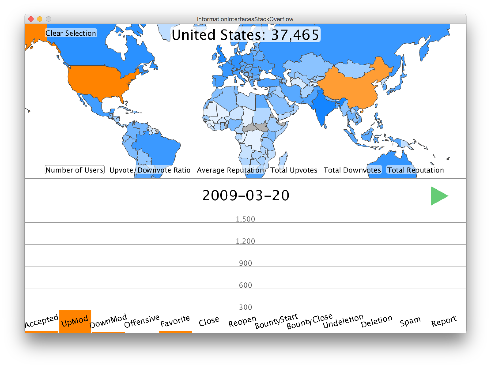

Graphical tool to reveal insights about stack overflow users around the world based on aspects of their contributions.

By Evan Frenkel and Zachary Chapman

## Controls

#### Map
Scroll mouse wheel to zoom.
Click and drag to pan.
Double click on location to pan to it and zoom in one level.
Hover over a country to see its name and the value of the selected attribute at the top center of the screen.
Click on a country to select it. If any countries are selected, only their data will be used in the vote bar chart.
Click on the "clear selection" button to deselect all countries.
Click on one of the other buttons to choose which attribute the countries show.

#### Vote bar
Scroll mouse wheel up/down to zoom in/out. The y axis indexes will update accordingly.
Click anywhere on the bar chart to toggle playback through time. An icon at the center right indicates whether it is currently paused or playing.
Click anywhere and drag left/right to go backwards/forwards in time. The date is displayed in the center of the screen in a YYYY-MM-DD format.

## Findings
We found that the USA is the leader in raw numbers, but not necessarily when it comes to average values by user, for example: Madagascar has the best ratio of upvotes to downvotes, and when it comes to average user reputation, the USA is only average, thoroughly beaten by Bulgaria. We can also see that many vote types (such as bounties) were not used at all for much of the beginning, and it took a while before close votes began occurring. We can also watch the overall rise in votes over the period of time we have data for; Stack Overflow definitely increased in popularity each year.

## Files
Data files: "countries.geo.json", "country-codes.csv", "countrydata2.csv", "votes2.csv"
These should be in the sketch directory.

Libraries: Unfolding (copy contents of "libraries" into your libraries directory)
